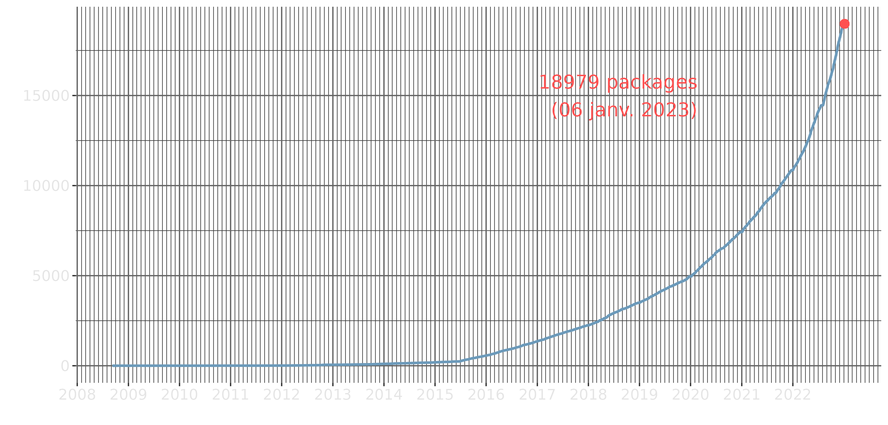
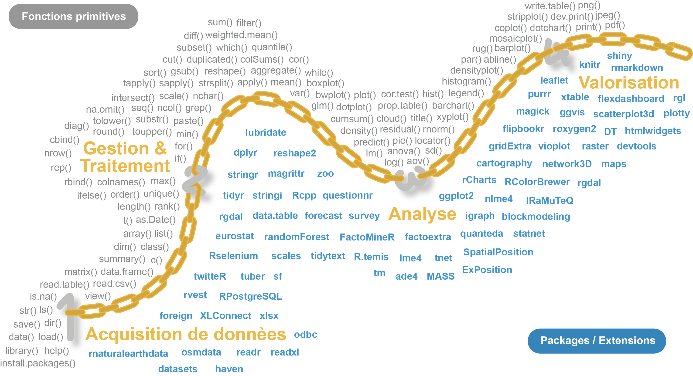
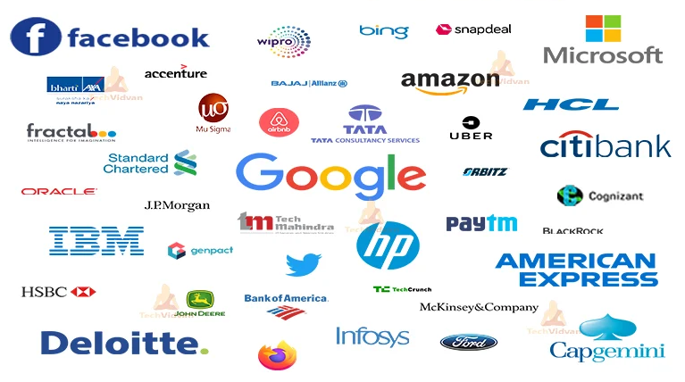
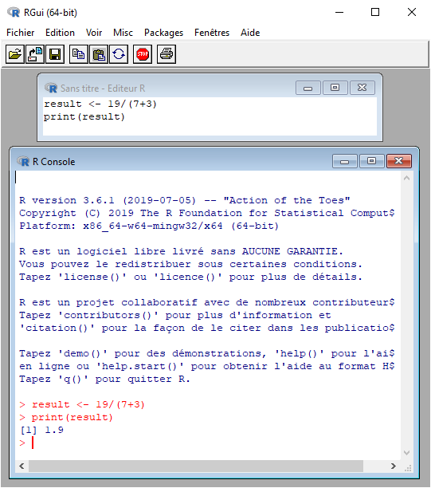
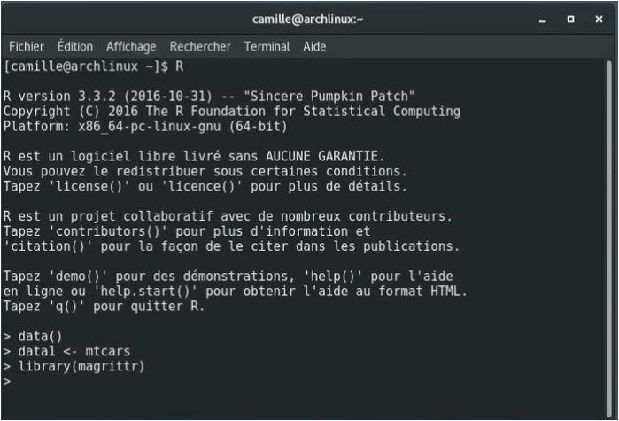
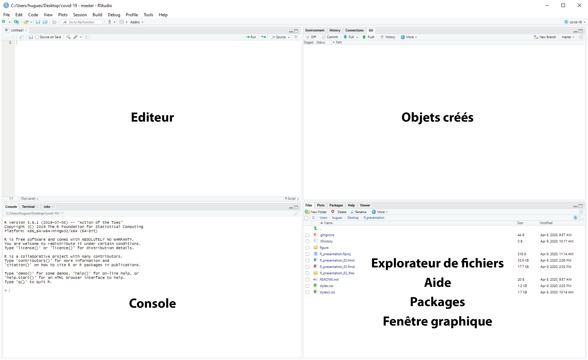
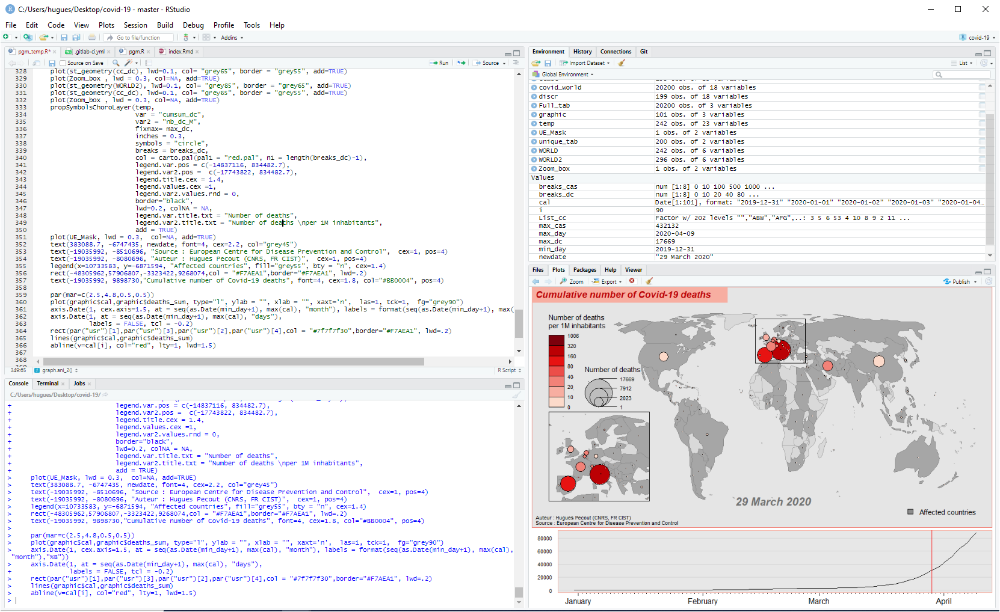

```{r setup, include=FALSE}
knitr::opts_chunk$set(echo = FALSE)
options("scipen" = 10)


```


## Source de ce document


Hugues Pecout. 2022. "Analyse de données avec R - Contextualisation et présentation de R et Rstudio". Séance du 14 octobre 2022 du groupe ElementR. 

CC BY-SA 4.0

- Code source mis à disposition sur le [GitLab d'ElementR](https://gitlab.huma-num.fr/elementr) :
<p class="smallpcenter">https://gitlab.huma-num.fr/elementr/session_1/Presentation_R</p>

- Diaporama consultable en ligne via GitLab :
<p class="smallpcenter">https://elementr.gitpages.huma-num.fr/session_1/Presentation_R/#/</p>


#  {data-background="figure/R.png" data-background-size="18%"}

## Histoire de R

<br>


<p class="smallpcenter">**R se base sur le langage de programmation S**, créé en 1988</p> 

<ul class="xpucsmall">
> - **1992**: **R. Gentleman** et **R. Ihaka démarrent le développement** (projet de recherche)
> - 1993: **Première version binaire** de R publiée sur Statlib
> - **1995**: **R est distribué en tant que logiciel open source, sous licence GPL2**
> - 1997: Création du *R core group*. Création du CRAN (par K. Jornik et F. Leisch)
> - 1999: Création du site web de R (*r-project.org*) . Première réunion physique de la *R core team* 
> - **2000**: **R 1.0.0** est publié. John Chambers (créateur du langage S), rejoint la *R Core team* 
> - 2001: Création de *R News* (qui deviendra *R Journal*)
> - **2003**: **Création de la** ***R Foundation***
> - 2004: Première conférence *UseR!* (Vienne)
> - **2004**: **R 2.0.0** est publié
> - 2009: Première édition du *R Journal*
> - **2013**: **R 3.0.0** est plublié
> - **2015**: **Création du** ***R Consortium*** (avec la participation de la *R Foundation*)
> - **2020**: **R 4.0.0** est plublié    

</ul>
<br>
<p class="xsmallp" align="center">*https://blog.revolutionanalytics.com/2017/10/updated-history-of-r.html*</p>


## Soutiens importants


<br>

<p class="normp">Résultat de **30 années de recherche & développement**</p>

<br>

Des acteurs économiques importants **financent** le développement de **R** : ***Microsoft***, ***Google***, ***Oracle***, ***Esri***... 

<br>

<p class="moyp">https://www.r-consortium.org/members.</p>


## Libre et multi-plateforme

<aside class="notes">
Il fait partie du mouvement du logiciel libre (lancé par Richard Stallman en 1985), qui est un mouvement politique et social dont l'objectif est d'offrir des logiciels libres de secrets commerciaux  (un code source libre).

</aside>


<br>

<ul class="pucsmall">

> - **R est un logiciel/langage libre (open source)** 

<br>

> - Il fait partie de la liste des **paquets GNU GPLv3**


<br>

> - **R est multi-plateforme**


</ul>

<br>


```{r}

Software <- c("R")
Windows <- c("oui")
macOS <- c("oui")
Linux <- c("oui")
BSD <- c("oui")
Otros_Unix <- c("oui")

tab <- data.frame(Software, Windows, macOS, Linux, BSD, Otros_Unix)

colnames(tab) <- c(" Logiciel/Sytsème"," Windows", " MacOS", " Linux", " BSD", " Autres Unix")

knitr::kable( tab)
```


## Développement illimité

<br>

```{r warning=FALSE, message=FALSE, eval=TRUE, include= TRUE, echo=FALSE}

library('rvest')
url <- "https://cran.r-project.org/web/packages/available_packages_by_date.html"
#Reading the HTML code from the website
webpage <- read_html(url)
td <- webpage %>%  html_nodes("td")
rank_data <- html_text(td)

vec <- c(NULL)
for (t in seq(1,length(rank_data),3))  {
vec <-  c(vec, rank_data[t])
}

library(stringr)
vec <- str_trim(vec)
test <- as.data.frame(vec)
test$nb <- 1
test$date <- as.Date(test$vec)
test <- test[,c(3:2)]

library(plyr)
test2 <-  ddply(test, .(date), summarize, nb=sum(nb))
test2$cum <- cumsum(test2$nb)
test <- test2[,c(1:3)]

nb_function_base <- length(lsf.str("package:base"))

# Nombre de fonctions primitives
base <- length(lsf.str("package:base")) 
stats <- length(lsf.str("package:stats")) 
utils <- length(lsf.str("package:utils")) 
methods <- length(lsf.str("package:methods")) 
grDevices <- length(lsf.str("package:grDevices")) 
graphics <- length(lsf.str("package:graphics")) 
datasets <- length(lsf.str("package:datasets")) 

Nb_prim <- base + utils + stats + methods + grDevices + graphics + datasets 

library(grid)
library(splines)
library(stats4)
library(tcltk)
library(tools)
grid <- length(lsf.str("package:grid")) 
splines <- length(lsf.str("package:splines")) 
stats4 <- length(lsf.str("package:stats4")) 
tcltk <- length(lsf.str("package:tcltk")) 
tools <- length(lsf.str("package:tools")) 

Nb_prim_2 <- grid + splines + stats4 + tcltk + tools


Nb_prim <- Nb_prim  + Nb_prim_2

```


<p class="moyp">**R propose `r Nb_prim` fonctions standard** (primitives)</p>

<p class="smallpcenter">**Sur ce socle commun peut s'ajouter de nombreux packages**, mis à disposition sur le      
[***Comprehensive R Archive Network***](https://cran.r-project.org/web/packages/available_packages_by_name.html) (**CRAN**). Ex : </p>

<ul class="xpucsmall">
> - ***FactoMineR*** - **analyse multidimensionnelle de données**
> - ***quanteda*** - **analyse textuelle**
> - ***igraph*** - **analyse de réseau**
> - ***sf*** - **manipulation de données spatiales vectorielles**
> - ***terra*** - **manipulation de données spatiales (raster et vecteur)**
> - ***shiny*** - **applicacions web interactives**
> - ...
</ul>

<br>


<p class="moyp">**R a une structure modulaire qui offre toute une gamme d'applications possibles**. **Son expansion n'est limitée que par les contributions**.</p>


## Développement illimité

<br>

```{r warning=FALSE, message=FALSE, eval=TRUE, include= TRUE, echo=FALSE, fig.width = 10, fig.height=  4.8}

library(ggplot2) 

p <- ggplot(test2) + 
geom_line(aes(date, cum), lwd = 1, col = '#6c9aba') + 
xlab("") + 
ylab("") + 
scale_x_date( date_minor_breaks = "1 month", date_labels = "%Y", breaks = as.Date( c('2005-01-01', 
                                                                                     '2006-01-01', 
                                                                                     '2007-01-01', 
                                                                                     '2008-01-01', 
                                                                                     '2009-01-01', 
                                                                                     '2010-01-01', 
                                                                                     '2011-01-01',
                                                                                     '2012-01-01',
                                                                                     '2013-01-01', 
                                                                                     '2014-01-01', 
                                                                                     '2015-01-01', 
                                                                                     '2016-01-01', 
                                                                                     '2017-01-01', 
                                                                                     '2018-01-01', 
                                                                                     '2019-01-01', 
                                                                                     '2020-01-01', 
                                                                                     '2021-01-01',
                                                                                     '2022-01-01'))) + 
annotate(geom = "text", x = as.Date('2018-08-23'), y = 15000, label = paste0( max(test2$cum), ' packages \n (', format(Sys.time(), '%d %b %Y'), ")"), color ="#ff5151", size = 5.5) + 
geom_point(aes(x = max(date), y = max(cum)), color = "#ff5151", size = 3) + 
theme(axis.text = element_text(size = 12, colour ="grey90"), 
      panel.background = element_rect(fill = "transparent"), 
      plot.background = element_rect(fill = "transparent", color = NA), 
      panel.grid.major = element_line(colour = "grey40"), 
      panel.grid.minor = element_line(colour = "grey25"), 
      legend.background = element_rect(fill = "transparent"), 
      legend.box.background = element_rect(fill = "transparent")) 

ggsave(p, filename = "figure/graph.png", bg = "transparent", dpi = 300) 

```


<p class="smallpcenter">Nombre de packages disponibles sur le [CRAN](https://cran.r-project.org/)</p>

</p>


## Polyvalent

<br>


<p class="moyp">Les **packages mises à disposition permettent d'opérer sur l'ensemble de la chaîne de traitement**. De la collecte des données à la valorisation des résultats (gaphique, document, site web...)<P> 

<br>


<p class="nrmp">**Cette polyvalence** permet à R de **compléter**, de **concurrencer** voire de **remplacer** toute une série de **logiciels existants**</p>


## Polyvalent

<br>

<p align="center"></p>


## Grande communauté d'utilisateurs

 
<p align="center"></p>

<p class="xsmallp">https://benubah.github.io/r-community-explorer/rugs.html</p>


## ...Et d'entreprises

<p align="center"></p>

<p class="xsmallp">https://techvidvan.com/tutorials/career-in-r-programming/</p>


## Fiable


<br>

<ul class="pucsmall">
> - **Financement d'acteurs économiques** (*R Consortium*)
> - **Communauté impliquée** et **importante**
> - Le fonctionnement d'un logiciel **open source est vérifiable**
> - Tous les logiciels ont des failles, mais...

</ul>


<br>       
<p class="moyp">**L'information circule vite dans les communautés des logiciels libres**.</p>


## Travaux reproductibles

<br>  

<ul class="pucsmall">

> - **Un seul logiciel** pour **toutes les étapes de traitement**
> - Les travaux sont **facilement archivés et partagés** (script) 
> - Il suffit d'**un ordinateur pour les reproduire....**


</ul>

<br>

<p class="moyp">**La recherche reproductible**, c'est le **partage** et la **transparence** !</p>


## Inconvénients


<br>


<ul >
> - **R est un langage de programmation**


<br>

> - **Son apprentissage est long et parfois douloureux**


<br>

> - **R et ses ressources clefs sont en anglais**


<br>

> - **L' interface de R est très rudimentaire, mais...**


</ul>


#  {data-background="figure/Rstudio_logo.png" data-background-size="30%"}


## Qu'est-ce que Rstudio? 

<br>

<p class="smallpcenter">RStudio (aujourd'hui [Posit](https://www.rstudio.com/blog/rstudio-is-becoming-posit/)) est une entreprise qui développe et publie des logiciels et des services basés sur R.
**C'est l'acteur le plus important de la communauté**.</p>  

<p class="smallpcenter">**Rstudio a développé plusieurs packages de référence**. *Ex :*</p>

<ul class="xpucsmall">
> - [**dplyr**](https://dplyr.tidyverse.org/) & [**tidyr**](https://tidyr.tidyverse.org/) (*manipulation de tableau*)
> - [**stringr**](https://stringr.tidyverse.org/index.html) (*manipulation de chaîne de caractères*)
> - [**ggplot2**](https://ggplot2.tidyverse.org/) (*représentation graphique*)
> - [**rmarkdown**](https://rmarkdown.rstudio.com/) (*programmation lettrée*)
> - [**flexdashboard**](https://pkgs.rstudio.com/flexdashboard/) (*tableau de bord*)
> - [**shiny**](https://shiny.rstudio.com/) (*application interactive*)
> - [**reticulate**](https://rstudio.github.io/reticulate/) (*interopérabilité entre R et python*)
> - [**plumber**](https://www.rplumber.io/) (*Création d'API*)

> - ...

</ul>

      
<p class="smallpcenter">**Rstudio** propose également **un Environnement de Développement Intégré** ([**IDE**](https://rstudio.com/products/rstudio/)), qui **facilite énormément l'utilisation de R**.</p>


## Interface rudimentaire de R

<div id="left">

<p align="center"></p>


<p class="legend" align="center">*Interface de R sur Windows*</p>


</div>

<div id="right">

<p align="center"></p>


<p class="legend" align="center">*Pas d'interface sur Linux (terminal)*</p>

<br>

<p class="smallpcenter" >**L'IDE Rstudio facilite l'apprentissage de R et son utilisation**</p>

</div>


## IDE Rstudio

<p align="center"></p>


## IDE Rstudio

<p align="center"></p>

## Autres points forts

<br>

<ul class="pucsmall">
> - **Fonctionnalités clic-bouton**
> - **Raccourcis clavier**
> - **Auto-complétion**
> - **Création de projet**

</ul>

<br>

<p class="nrmp">Parce que c'est **simple**, **complet** et en constante **évolution**...</p>
   

**Utilisez l'environnement RStudio!**


## Besoin d'aide ?

<br>

<p class="moyp">**De nombreuses ressources sont référencées sur...**</p>


<a href="https://rzine.fr/publication/"></a><br><p class="moyp"><a href="https://rzine.fr" target="_blank">rzine.fr</a></p>


# {data-background="figure/R.png" data-background-size="20%"}


<h3>**Diaporama réalisé avec...**</h3>

<br>
<br>
<br>
<br>
<br>
<br>
<br>
<br>


<p class="smallpcenter"><b>`r sessionInfo()[1]$R.version$version.string`</b></p>


